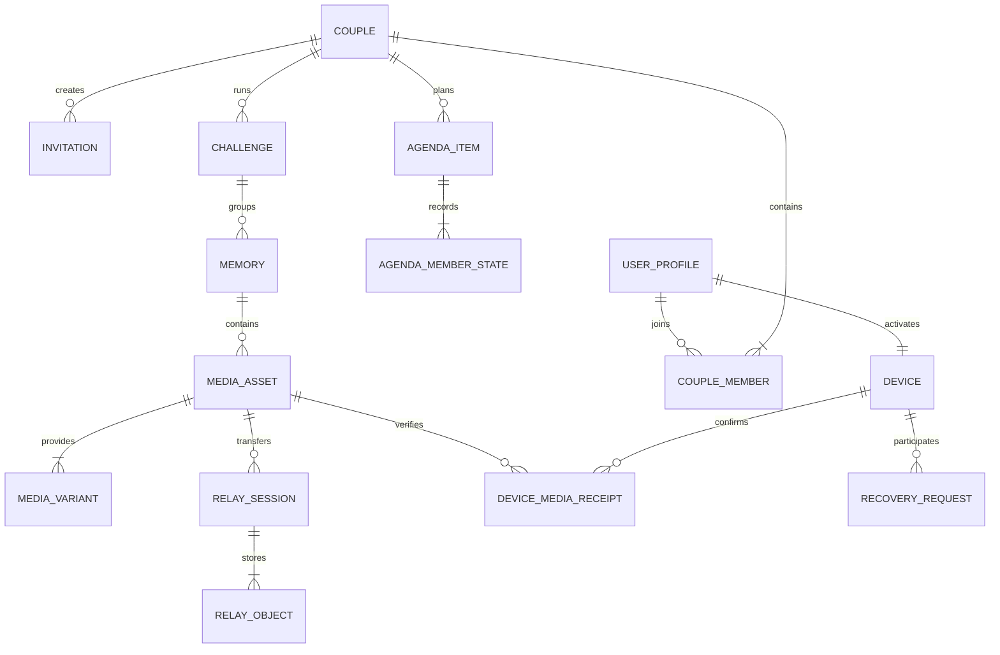
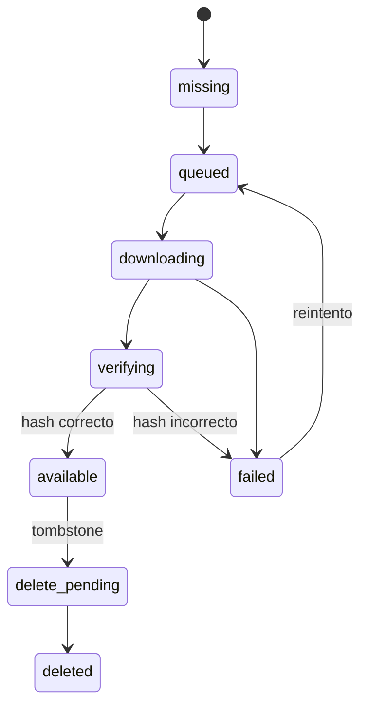
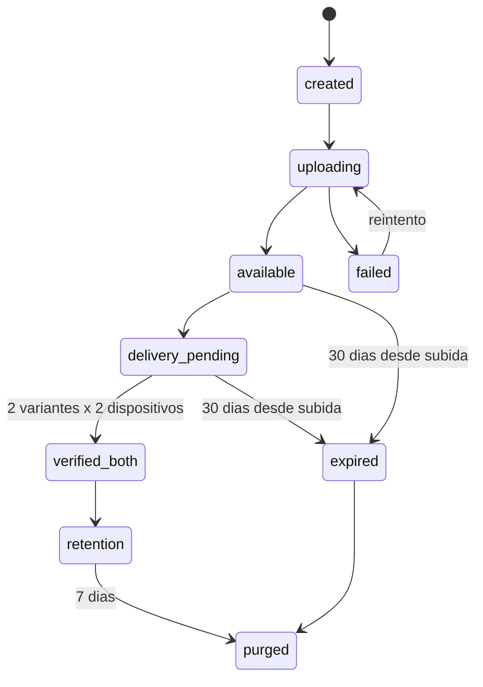
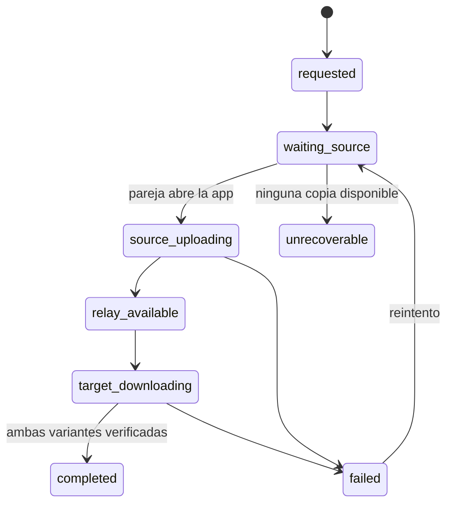

# Arquitectura de datos y sincronizacion

Documento fuente para implementar el backend y la sincronizacion nativa de Vive2.

## Objetivo

Vive2 tendra un backend para identidad, pareja, agenda, retos, recuerdos y coordinacion.
Las fotografias no se conservaran permanentemente en el backend: cada miembro guardara
en su movil las dos resoluciones y el almacenamiento remoto actuara como relay temporal.

La arquitectura debe seguir siendo independiente del proveedor. Auth, base de datos,
notificaciones y object storage se consumiran mediante interfaces propias.

## Decisiones cerradas

- App nativa con Capacitor para iOS y Android.
- Autenticacion con Google o email y contrasena.
- El codigo de invitacion solo se introduce despues de autenticarse.
- Una cuenta solo puede tener un dispositivo activo.
- Una pareja tiene dos miembros y cada miembro aporta como maximo una foto por recuerdo.
- SQLite almacena metadatos, cursores y colas locales.
- Filesystem privado almacena originales y versiones optimizadas.
- Ambas resoluciones se descargan automaticamente con cualquier conexion.
- Bucket privado, URLs firmadas y cifrado del proveedor; no E2E en v1.
- El relay se elimina 7 dias despues de verificar ambos moviles y, como maximo, 30 dias
  despues de la subida.
- Borrar o reemplazar se propaga sin restauracion.
- No se incluye backup premium ni migracion de los datos mock/locales del prototipo.

## Invariantes

1. Una foto activa pertenece a un recuerdo y a uno de sus dos miembros.
2. Una foto activa tiene exactamente dos variantes: `original` y `optimized`.
3. Una variante solo esta disponible cuando el hash SHA-256 del archivo local coincide.
4. El backend nunca almacena rutas locales de archivos.
5. Un relay puede desaparecer sin eliminar `MediaAsset` ni sus metadatos.
6. Un comando sincronizado usa una clave de idempotencia y puede repetirse sin duplicar datos.
7. Un dispositivo antiguo no puede volver a introducir datos borrados.
8. Solo el propietario puede subir, reemplazar o borrar su foto.

## Modelo remoto

Todas las entidades sincronizables usan UUID, `createdAt`, `updatedAt`, `version` y,
cuando corresponda, `deletedAt`.

### Identidad y pareja

- `UserProfile`: usuario autenticado, nombre, email, avatar y proveedor de acceso.
- `Device`: usuario, instalacion, plataforma, push token, estado, ultima actividad y fecha
  de reemplazo. Solo puede existir uno activo por usuario.
- `Couple`: pareja, estado `active` o `unlinked`, creador y fechas.
- `CoupleMember`: pareja, usuario, slot `partner_one` o `partner_two`, entrada y salida.
- `Invitation`: pareja, hash del codigo, creador, estado `active`, `redeemed` o `revoked`.
  No caduca por tiempo; se revoca al canjearla o desvincular la pareja.

### Producto

- `CustomPlan`: plan propio de una pareja. El catalogo base continua en los JSON de la app.
- `AgendaItem`: pareja, referencia de plan, creador, estado, fecha acordada y version.
- `AgendaMemberState`: item, usuario, aceptacion del plan, propuesta de fecha y aceptacion.
- `Challenge`: pareja, secuencia, objetivo 10/20/30, inicio, cierre y estado.
- `Memory`: pareja, reto, snapshot del plan, fecha, lugar, nota, valoracion y creador.

### Fotografias y entrega

- `MediaAsset`: recuerdo, propietario, slot, version logica y estado `active` o `deleted`.
- `MediaVariant`: asset, tipo `original` o `optimized`, MIME, dimensiones, bytes y SHA-256.
- `RelaySession`: asset, motivo `initial_delivery` o `device_recovery`, estado y expiracion.
- `RelayObject`: sesion, variante, object key privado, subida y purgado.
- `DeviceMediaReceipt`: asset, variante, dispositivo, estado y hash verificado.
- `RecoveryRequest`: dispositivo destino, dispositivo fuente, progreso y ultimo error.
- `ChangeLog`: secuencia monotona, pareja, entidad, operacion, version y timestamp.



## Modelo local

SQLite refleja las entidades funcionales necesarias para trabajar offline y anade:

- `local_media(assetId, variant, localUri, sha256, bytes, status, verifiedAt)`.
- `sync_outbox(commandId, type, payload, attempts, nextRetryAt, createdAt)`.
- `sync_state(coupleId, cursor, lastSuccessfulSyncAt)`.
- `device_state(deviceId, installationId, registeredAt)`.

Los binarios nunca se guardan en SQLite ni en Zustand. Se guardan en el directorio privado
de la app mediante `@capacitor/filesystem`. SQLite se encapsula tras un adaptador para
`@capacitor-community/sqlite` compatible con la version de Capacitor usada por el proyecto.

La web conserva un adaptador local de desarrollo, pero no se considera una replica duradera:
el navegador puede eliminar IndexedDB o Cache Storage.

## Contratos de servicios

```ts
interface AuthService {
  signInWithGoogle(): Promise<AuthSession>;
  signInWithEmail(email: string, password: string): Promise<AuthSession>;
  signOut(): Promise<void>;
}

interface BackendRepository {
  registerDevice(input: RegisterDeviceInput): Promise<DeviceRegistration>;
  pullChanges(cursor?: string): Promise<ChangeBatch>;
  pushCommands(commands: SyncCommand[]): Promise<CommandResult[]>;
}

interface ObjectRelayService {
  prepareUpload(assetId: string, reason: RelayReason): Promise<RelayUploadTarget>;
  completeUpload(sessionId: string, variants: UploadedVariant[]): Promise<void>;
  getDownloadTargets(sessionId: string): Promise<RelayDownloadTarget[]>;
  acknowledgeVariant(input: VariantReceiptInput): Promise<void>;
}

interface LocalMediaStore {
  save(assetId: string, variant: MediaVariantKind, bytes: Blob): Promise<LocalMedia>;
  read(assetId: string, variant: MediaVariantKind): Promise<Blob>;
  remove(assetId: string): Promise<void>;
}
```

Adaptadores adicionales: `LocalDatabase`, `ImageProcessor`, `SyncEngine`, `NetworkService`,
`PushService` y `Clock`. Ningun componente React accede directamente al proveedor backend.

## Preparacion de imagenes

Politica de entrada y procesado:

- Formatos admitidos: JPEG, PNG y WebP. Se validan MIME, firma real, dimensiones y bytes
  tanto en cliente como en backend; la extension y el atributo HTML `accept` no bastan.
- Entrada previa al procesado: maximo 20 MB.
- Variante `print`: maximo 3508 px en el lado largo, 12 MP y 8 MB. Es suficiente para
  una pagina A4 a aproximadamente 300 ppp sin conservar capturas 4K o fotos enormes.
- Variante `optimized`: WebP, lado mayor de 1600 px y calidad 80.

Al seleccionar una foto:

1. Validar tipo, firma, dimensiones y tamano; rechazar cualquier contenido no permitido.
2. Generar `print` respetando sus limites y `optimized` en WebP.
3. Calcular SHA-256, dimensiones y bytes de ambas variantes.
4. Guardar ambas en Filesystem y registrar `local_media` como `available`.
5. Crear `MediaAsset` y encolar la subida si existe una pareja vinculada.

Si aun no hay pareja, las fotos permanecen locales. Al vincular al segundo miembro se
encolan todos los assets activos.

## Maquinas de estados

### Replica local



### Relay temporal



`deleteAt` es el menor valor entre siete dias tras `verified_both` y treinta dias desde
la subida. Un job idempotente purga los objetos y conserva hashes y metadatos.

### Recuperacion de dispositivo



## Flujos principales

### Sincronizacion normal

1. El motor envia primero la outbox de metadatos.
2. Solicita una sesion y URLs firmadas para las dos variantes.
3. Sube con reanudacion y marca la sesion disponible.
4. El otro dispositivo recibe push o descubre el cambio mediante `pullChanges`.
5. Descarga automaticamente original y optimizada, verifica hashes y confirma.
6. El backend inicia la retencion cuando existen cuatro receipts validos.

Los errores de red usan backoff exponencial con jitter. Reiniciar la app no pierde el
progreso porque todos los comandos y estados viven en SQLite.

### Reemplazo y borrado

- Reemplazar incrementa la version del slot y crea un asset nuevo.
- El asset anterior se oculta inmediatamente y recibe un tombstone.
- Cada movil borra ambas variantes al recibirlo y confirma la operacion.
- No existe papelera ni restauracion.
- Los tombstones de metadatos se mantienen 90 dias para evitar resurrecciones offline.

### Cambio de movil

1. Autenticar y registrar la nueva instalacion; el dispositivo anterior pasa a `replaced`.
2. Restaurar metadatos mediante `pullChanges`; la app puede usarse mientras bajan fotos.
3. Descargar desde relay los assets aun disponibles.
4. Crear `RecoveryRequest` para los assets purgados.
5. Notificar al movil de la pareja para que vuelva a subir sus copias temporalmente.
6. Si la pareja no conserva una variante, marcarla `unrecoverable` y mostrarla como faltante.

Si ambos borran la app o pierden sus dispositivos despues del purgado, las fotografias se
pierden. Los metadatos funcionales continuan en backend.

### Generacion del libro

El libro se genera localmente desde originales verificados. Antes de empezar se valida que
todos los assets seleccionados esten `available`; si falta alguno se intenta recuperar y se
muestra progreso. Nunca se usa silenciosamente una optimizada para impresion.

## Conflictos y permisos

- El servidor valida version y pertenencia a pareja en cada comando.
- Operaciones repetidas con el mismo `idempotencyKey` devuelven el resultado anterior.
- Los escalares usan version optimista; un rechazo actualiza local y reaplica la intencion.
- La version activa mas alta de cada slot gana; una subida antigua queda `superseded`.
- Ambos miembros gestionan agenda, retos y recuerdos compartidos.
- Cada miembro solo modifica su propio `MediaAsset`.
- Las URLs firmadas tienen vida corta y solo se generan para miembros activos de la pareja.

## Observabilidad

Registrar sin incluir fotos, URLs firmadas ni contenido personal:

- assets pendientes por estado y antiguedad;
- bytes actuales del relay;
- fallos y reintentos por operacion;
- tiempo hasta `verified_both`;
- recuperaciones completadas y `unrecoverable`;
- ejecuciones y errores del job de purgado.

La UI mostrara `X de Y fotos protegidas en ambos moviles`, progreso de sincronizacion,
errores recuperables y uso local aproximado.

## Estrategia de pruebas

- Unitarias: transiciones, hashes, idempotencia, backoff, versiones y `deleteAt`.
- Integracion: subida interrumpida, descarga corrupta, reanudacion y purgado.
- Sin conexion: crear recuerdo, reemplazar y borrar antes de recuperar red.
- Dispositivo nuevo: relay disponible, relay purgado, pareja offline y asset perdido.
- Seguridad: aislamiento por pareja, URLs firmadas y rechazo de cambios sobre foto ajena.
- Nativas: cierre forzado, poco espacio, segundo plano y reinicio en iOS/Android.

## Roadmap de implementacion

1. Crear tipos de dominio, contratos y backend falso, manteniendo el modo local actual.
2. Integrar SQLite, Filesystem y migraciones locales versionadas.
3. Implementar autenticacion, dispositivos, parejas e invitaciones.
4. Sincronizar metadatos mediante outbox, cursor e idempotencia.
5. Implementar procesado, relay, receipts, retencion y purgado.
6. Anadir recuperacion entre dispositivos y notificaciones push.
7. Generar el libro desde originales y completar pruebas nativas.

La eleccion del proveedor backend se hara despues de validar estos contratos. Cualquier
adaptador debe respetar este modelo sin filtrar SDKs concretos hacia componentes o store.
