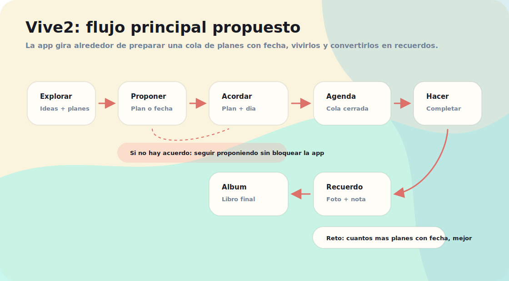
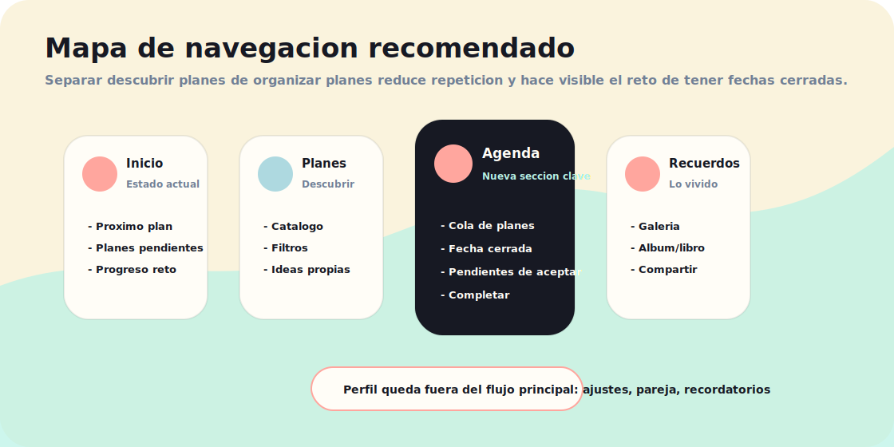
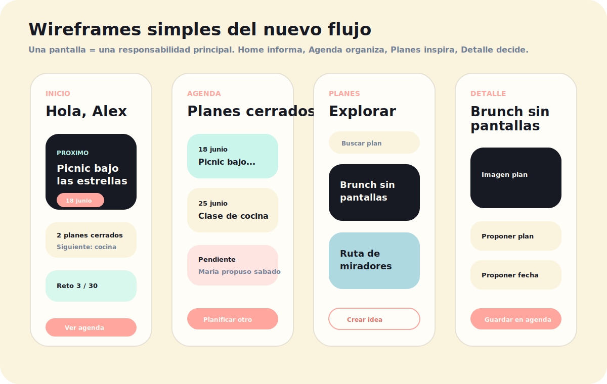

# Product reset: Vive2

Documento de reorganizacion antes de seguir implementando.

## Por que hacemos este reset

La app ha evolucionado desde una lista bonita de planes hacia algo mas interesante: ayudar a una pareja a cerrar planes reales con fecha y convertirlos en recuerdos.

El problema actual es que hemos ido anadiendo piezas sobre la marcha:

- Home mezcla recomendacion, creacion de ideas, progreso, ultimo recuerdo y preparacion.
- Solo existe la idea de `nextPlan`, pero el producto necesita una cola de planes cerrados.
- La seleccion compartida esta repartida entre propuestas de plan, propuestas de fecha y estado de proximo plan.
- Algunas acciones se repiten en Home, Planes y Detalle.
- Perfil tiene cosas de configuracion, invitacion y simulacion MVP mezcladas.
- Recordatorios existen como pantalla separada, pero el producto real deberia recordarte planes ya cerrados.

Conclusion: no conviene seguir puliendo pantalla por pantalla. Conviene redefinir el flujo y luego refactorizar manteniendo el lenguaje visual actual.

## Tesis de producto

Vive2 no debe girar alrededor de "ver ideas de planes".

Debe girar alrededor de:

> Preparar una cola de proximos planes en pareja, con dia cerrado, para ir viviendolos como reto y guardarlos como recuerdos.

Cuantos mas planes con fecha haya cerrados, mejor funciona la app.

## Flujo principal



El loop del producto es:

1. Descubrir o crear una idea.
2. Proponer plan.
3. Proponer dia.
4. Acordar plan y dia.
5. Guardarlo en Agenda.
6. Vivirlo.
7. Completarlo como recuerdo.
8. Alimentar progreso y album.

## Navegacion recomendada



### Bottom nav propuesto

- Inicio
- Planes
- Agenda
- Recuerdos
- Perfil

### Por que anadir Agenda

Si la app quiere que tengais cerrado el siguiente plan, y el siguiente, y el siguiente, la gestion de esa cola necesita un lugar propio.

Intentar meterlo dentro de Home hace que Home se vuelva larga y confusa. Intentar meterlo dentro de Planes mezcla dos trabajos distintos:

- Planes: descubrir que hacer.
- Agenda: decidir cuando y llevar control de lo que ya esta cerrado.

## Responsabilidad de cada seccion

### Inicio

Objetivo: responder rapido "que tenemos ahora entre manos".

Debe mostrar:

- Proximo plan confirmado.
- Si no hay proximo plan, una llamada clara a planificar.
- Resumen de la agenda: cuantos planes cerrados hay.
- Progreso del reto: completados / 30.
- Ultimo recuerdo solo si aporta, no como bloque protagonista.

No debe ser:

- Una lista larga de planes.
- Un formulario.
- La pantalla principal para editar preferencias.

### Planes

Objetivo: descubrir o crear ideas.

Debe mostrar:

- Catalogo de planes.
- Buscador y filtros.
- Crear idea propia.
- Acciones sobre cada plan:
  - Ver detalle.
  - Proponer para agenda.
  - Anadir a favoritos o "quizas", si se decide mas adelante.

No debe gestionar:

- Varios planes con fecha.
- Confirmaciones de calendario complejas.

### Agenda

Objetivo: organizar la cola de planes.

Debe mostrar:

- Proximo plan confirmado.
- Planes confirmados futuros.
- Propuestas pendientes:
  - plan pendiente de aceptar
  - fecha pendiente de aceptar
  - plan y fecha pendientes
- Accion "planificar otro".
- Accion "completar" cuando el dia ya llego o cuando la pareja quiera marcarlo hecho.

Esta es la pantalla clave nueva.

### Recuerdos

Objetivo: ver lo vivido.

Debe mostrar:

- Recuerdos completados.
- Album/libro.
- Compartir.

No debe mezclar:

- Planes pendientes.
- Propuestas.

### Perfil

Objetivo: ajustes y configuracion.

Debe incluir:

- Persona activa en MVP local.
- Pareja vinculada / invitacion.
- Preferencias.
- Recordatorios.
- Salir.

No debe competir con Agenda.

## Wireframes base



## Estados principales de producto

### Estado 1: pareja no vinculada

Home:

- Mostrar proximo plan o CTA de planificar.
- Mostrar card pequena para invitar a la pareja.

Perfil:

- Mantener la invitacion completa.
- Mantener toggle MVP/dev para simular pareja vinculada.

Agenda:

- Puede funcionar igualmente en local.
- Si no hay pareja vinculada, las acciones de aceptar por la otra persona se explican como demo local.

### Estado 2: no hay planes cerrados

Home:

- Hero: "Preparad vuestro proximo plan".
- CTA principal: "Explorar planes".
- CTA secundario: "Crear idea".

Agenda:

- Empty state claro: "Aun no teneis nada cerrado".
- CTA: "Planificar el primero".

### Estado 3: hay propuestas, pero no acuerdo

Agenda:

- Agrupar por "Pendiente de acordar".
- Cada propuesta debe mostrar:
  - quien propuso el plan
  - que plan propuso
  - que fecha propuso, si existe
  - acciones: aceptar plan, aceptar fecha, cambiar

Home:

- Mostrar resumen compacto, no todo el detalle.
- CTA: "Resolver en Agenda".

### Estado 4: hay planes confirmados

Home:

- Card celebratoria del proximo plan.
- Mostrar fecha y CTA a detalle/completar.
- Mostrar "X planes cerrados" como motivacion.

Agenda:

- Lista ordenada por fecha.
- El primer plan es el proximo.
- Los siguientes refuerzan la idea de reto.

### Estado 5: plan completado

Completar:

- Foto opcional.
- Lugar.
- Nota.
- Valoracion.

Despues:

- Crear recuerdo.
- Sacar el plan de Agenda.
- Aumentar progreso.
- Mostrar celebracion breve o card de recuerdo guardado.

## Requisitos funcionales MVP reorganizado

### Planes y agenda

- La app debe permitir tener multiples planes futuros con fecha.
- Cada item de agenda debe tener:
  - `id`
  - `planId` o referencia a plan propio
  - `date`
  - `status`
  - `createdByPartnerId`
  - confirmacion de plan por cada miembro
  - confirmacion de fecha por cada miembro
- La agenda debe ordenarse por fecha ascendente.
- El proximo plan es el primer item confirmado no completado.
- Si se completa un plan, se transforma en recuerdo y sale de la agenda activa.
- Se puede planificar mas de un plan aunque aun no se haya completado el anterior.

### Multiusuario local MVP

- Debe mantenerse la persona activa para simular acciones.
- Cada miembro puede:
  - proponer plan
  - proponer fecha
  - aceptar propuesta del otro
  - cambiar su propuesta
- Si ambos coinciden en plan y fecha, se crea o confirma un item de agenda.
- Si ambos proponen planes distintos, no se debe resolver automaticamente de forma magica en el MVP nuevo.
- Mejor comportamiento: mostrar ambas propuestas y pedir acuerdo.

### Ideas propias

- Crear idea propia debe vivir principalmente en Planes.
- Home puede tener CTA pequeno, pero no debe duplicar todo el formulario.
- Una idea propia puede convertirse en item de agenda.

### Recordatorios

- Recordatorios deberian evolucionar desde "recordatorio mensual generico" a "recordatorios de agenda".
- MVP intermedio:
  - seguir con ajustes en Perfil
  - en Agenda mostrar que un plan confirmado puede recordarse

### Recuerdos

- Recuerdo nace al completar un item de agenda o un plan suelto.
- Si no hay foto, usar fallback visual.
- Recuerdos no deben gestionar decisiones futuras.

## Requisitos de UX

- Cada pantalla debe tener una accion principal evidente.
- Home debe sentirse ligera.
- Agenda debe sentirse como "tenemos la vida un poco mas organizada", no como calendario de empresa.
- Las cards fotograficas se reservan para planes importantes.
- Las cards de propuesta deben ser compactas.
- No usar modales para decisiones frecuentes.
- Usar modales solo para feedback puntual o confirmaciones destructivas.
- Las fechas se seleccionan con dia por ahora, sin hora.
- El lenguaje debe hablar de "vuestros planes" y "lo que teneis cerrado", no solo "tus tareas".

## Requisitos visuales

Mantener:

- Paleta actual:
  - powder blush
  - eggshell
  - icy aqua
  - light blue
- Bottom nav flotante con blur sutil.
- Cards redondeadas con sombra suave.
- Botones pill.
- Fraunces para titulos emocionales.
- Manrope para UI.
- Logo actual en onboarding/home/PWA.

Evitar:

- Exceso de blanco sin jerarquia.
- Gradientes demasiado fuertes en navegacion.
- Repetir la misma card en Home y Planes.
- Pantallas con demasiadas decisiones juntas.

## Modelo de datos recomendado

La store actual puede evolucionar hacia esto:

```ts
type AgendaItemStatus =
  | 'draft'
  | 'pending_agreement'
  | 'confirmed'
  | 'completed'
  | 'cancelled';

type AgendaItem = {
  id: string;
  planId: string;
  date?: string;
  status: AgendaItemStatus;
  planAcceptedBy: PartnerId[];
  dateAcceptedBy: PartnerId[];
  createdByPartnerId: PartnerId;
  createdAt: string;
  updatedAt: string;
};
```

Con esto se podrian eliminar o simplificar:

- `nextPlanId`
- `nextPlanDate`
- `planSelections`
- `planDateProposals`
- parte de `planResolution`

El proximo plan se calcularia:

```ts
const nextPlan = agenda
  .filter((item) => item.status === 'confirmed')
  .sort((a, b) => a.date.localeCompare(b.date))[0];
```

## Pantallas recomendadas despues del reset

### Mantener

- Onboarding.
- Home.
- Planes.
- Detalle de plan.
- Completar plan.
- Recuerdos.
- Album.
- Perfil.
- Recordatorios.

### Anadir

- Agenda.

### Simplificar

- Home: quitar duplicados y dejar resumen.
- Detalle de plan: proponer/anadir a agenda, no resolver todo ahi.
- Perfil: solo ajustes.

## Plan de refactor recomendado

### Fase 1: Producto y estado

- Crear modelo `AgendaItem`.
- Migrar `nextPlanId`, `nextPlanDate`, `planSelections`, `planDateProposals` hacia `agendaItems`.
- Crear selectores:
  - `getConfirmedAgendaItems`
  - `getNextAgendaItem`
  - `getPendingAgendaItems`
  - `getCompletedCount`

### Fase 2: Navegacion

- Anadir ruta `/agenda`.
- Anadir item Agenda en BottomNav.
- Home enlaza a Agenda para resolver propuestas.

### Fase 3: Pantallas

- Redisenar Home alrededor de:
  - proximo plan
  - resumen agenda
  - progreso
- Construir Agenda:
  - confirmados
  - pendientes
  - CTA planificar otro
- Ajustar PlanDetail:
  - proponer plan
  - elegir fecha
  - guardar/actualizar agenda

### Fase 4: Limpieza

- Eliminar duplicados de `PlanIdeaCard`.
- Revisar textos.
- Revisar estados vacios.
- Revisar mobile real.

## Decision recomendada

No empezaria de cero.

Recomendacion:

1. Mantener UI base, estilos, componentes y datos.
2. Rehacer la arquitectura de flujo alrededor de Agenda.
3. Refactorizar estado y pantallas en fases.

Esto aprovecha lo bueno que ya existe y arregla la causa real de la confusion: el producto ahora quiere ser una agenda emocional de planes, no solo una galeria de ideas.

